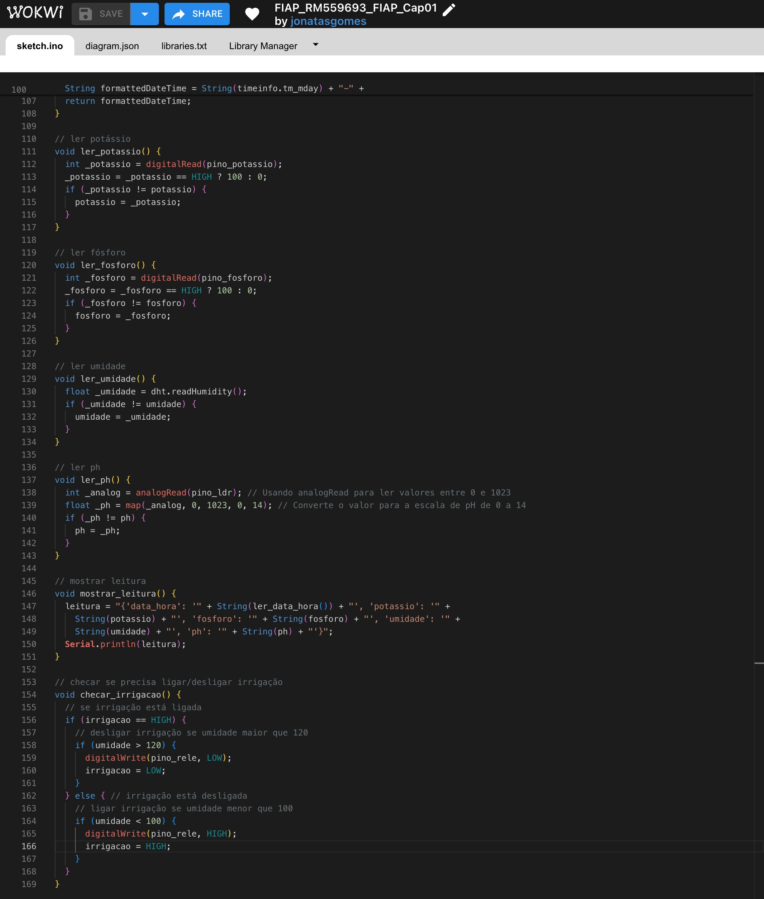
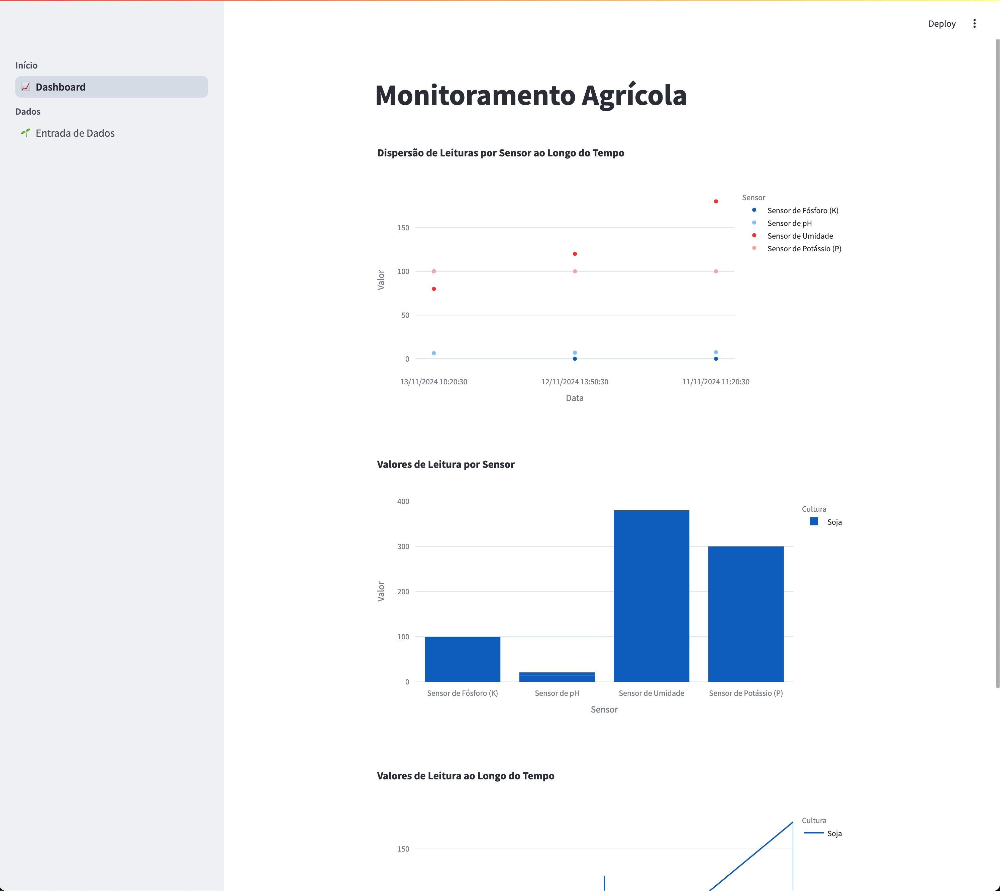

# FIAP - Faculdade de Informática e Administração Paulista

 

# Cap 1 - Construindo uma máquina agrícola

## One Man Band

## 👨‍🎓 Integrantes: 
- <a href="https://www.linkedin.com/in/jonatasgomes">Jônatas Gomes Alves</a>

## 👩‍🏫 Professores:
### Tutor(a) 
- <a href="https://www.linkedin.com/company/inova-fusca">Lucas Gomes Moreira</a>
### Coordenador(a)
- <a href="https://www.linkedin.com/in/profandregodoi">André Godoi Chiovato</a>

## 📜 Descrição

*O objetivo do projeto na Fase 3 será desenvolver um sistema de irrigação automatizado e inteligente que monitore a umidade do solo em tempo real, os níveis dos nutrientes P e K representados por botões (que vão “medir” os níveis como tudo ou nada; “true” ou “false”; botão pressionado e não pressionado) e o nível de pH representado pelo sensor LDR (Light Dependent Resistor), ajustando a irrigação conforme o necessário, isto é, ligando uma bomba d’água representado por um relé.*

## 🤔 Funcionamento
Abaixo temos os 4 sensores ligados ao ESP32. Também incluso um relé para ligar/desligar irrigação conforme umidade lida. No terminal o sistema irá gerá como saída o JSON com os dados dos sensores. Esse JSON pode ser manualmente importado no sistema de monitoramento.

Aqui o código fonte usado no circuto acima.

Temos também a tela de monitoramento dos dados lidos pelos sensores. Desenvolvida em Python com Streamlit e Oracle.

Vemos aqui a tela para input dos dados copiados dos sensores em formato JSON.

Esse é o código fonte Python usado na interface com o banco de dados Oracle.

## Link pro Vídeo
[Vídeo Demonstrando a Solução](https://youtu.be/7KczR_RljLA)

## 🗃 Histórico de lançamentos

* 1.0.0 - 11/11/2024

## 📋 Licença

<a property="dct:title" rel="cc:attributionURL" href="https://github.com/agodoi/template">MODELO GIT FIAP</a> por <a rel="cc:attributionURL dct:creator" property="cc:attributionName" href="https://fiap.com.br">Fiap</a> está licenciado sobre <a href="http://creativecommons.org/licenses/by/4.0/?ref=chooser-v1" target="_blank" rel="license noopener noreferrer" style="display:inline-block;">Attribution 4.0 International</a>.

