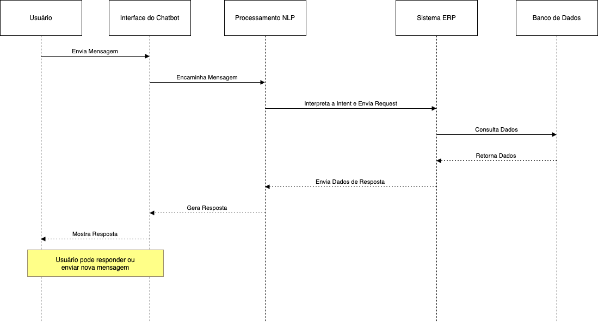

# FIAP - Faculdade de Informática e Administração Paulista

 

# Enterprise Challenge - Sprint 1

## One Man Band

## 👨‍🎓 Integrantes: 
- <a href="https://www.linkedin.com/in/jonatasgomes">Jônatas Gomes Alves</a>

## 👩‍🏫 Professores:
### Tutor(a) 
- <a href="https://www.linkedin.com/company/inova-fusca">Lucas Gomes Moreira</a>
### Coordenador(a)
- <a href="https://www.linkedin.com/in/profandregodoi">André Godoi Chiovato</a>

## 📜 Descrição

*Este chatbot será utilizado para atendimento ao cliente, permitindo a interação inicial automatizada com usuários para perguntas frequentes, orientações de serviços, e suporte básico. O escopo é focado em simplificar interações iniciais, redirecionando casos complexos a agentes humanos.*

## 🤔 Funcionamento

#### 1. **Camadas da Arquitetura**

   - **Interface de Usuário (Front-End)**: 
     - Disponível em widgets de chat para site e integração com aplicativos de mensagem como WhatsApp e Facebook Messenger. Permite comunicação simples e acessível ao usuário final.
   
   - **Motor de Processamento de Linguagem Natural (NLP)**:
     - Ferramentas sugeridas: Dialogflow (Google), Rasa (open-source) ou IBM Watson. Este componente interpreta as mensagens dos usuários, identificando intenções e contextos para fornecer respostas apropriadas.
   
   - **Back-End (Processamento e Integração com Sistemas)**:
     - Gerencia a lógica de negócio e faz a conexão com sistemas internos e banco de dados. Implementado em uma estrutura como Flask (Python) para gerenciar a comunicação entre o front-end e os dados.
     - Banco de Dados: MySQL ou MongoDB para armazenar interações, dados de clientes e informações relevantes.
   
   - **Infraestrutura**:
     - Para escalabilidade, utiliza uma infraestrutura baseada em microsserviços e Docker/Kubernetes. Opcionalmente, usa AWS ou Google Cloud para hospedagem, proporcionando estabilidade e segurança.

#### 2. **Elementos e Funções**

   - **Interface de Usuário**: Facilita a comunicação com o cliente através de uma interface de fácil acesso e interação intuitiva.
   - **NLP**: Processa as mensagens e devolve respostas contextualizadas, com ajustes constantes baseados em dados sintéticos e reais.
   - **Back-End e Integração com Banco de Dados**: Consolida a lógica de negócio, processando requisições e acessando dados necessários para fornecer informações ao usuário.
   - **Infraestrutura**: Garante que o sistema é escalável e seguro, preparado para um aumento na demanda de usuários.

Diagrama de Sequência

## Arquivos
[Descritivo do Projeto (.pdf)](src/RM559693_Projeto_Chatbot_AI.pdf "Descritivo do Projeto") 
[Diagrama de Sequência (.drawio)](src/FIAP_RM559693_Chatbot_IA.drawio "Diagrama de Sequência")

## 🗃 Histórico de lançamentos

* 1.0.0 - 13/11/2024

## 📋 Licença

<a property="dct:title" rel="cc:attributionURL" href="https://github.com/agodoi/template">MODELO GIT FIAP</a> por <a rel="cc:attributionURL dct:creator" property="cc:attributionName" href="https://fiap.com.br">Fiap</a> está licenciado sobre <a href="http://creativecommons.org/licenses/by/4.0/?ref=chooser-v1" target="_blank" rel="license noopener noreferrer" style="display:inline-block;">Attribution 4.0 International</a>.

