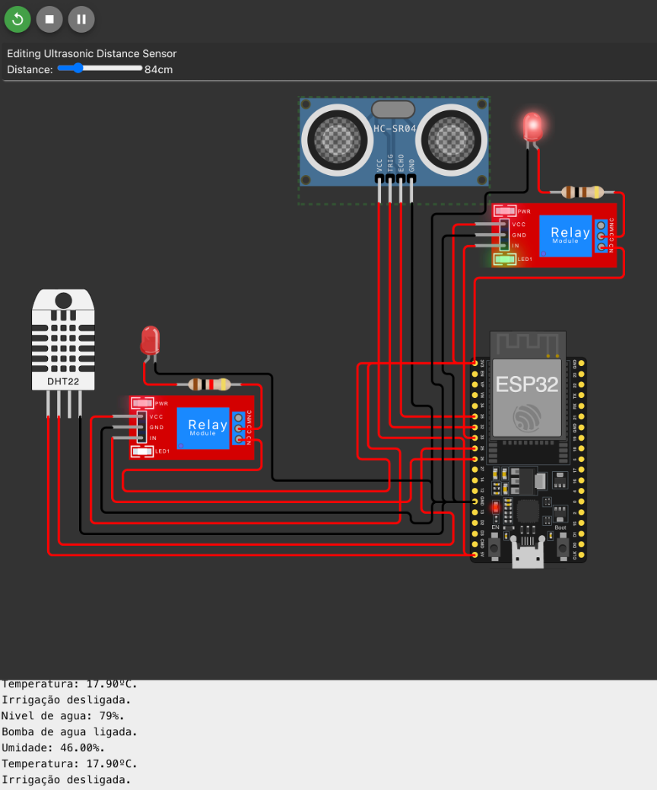
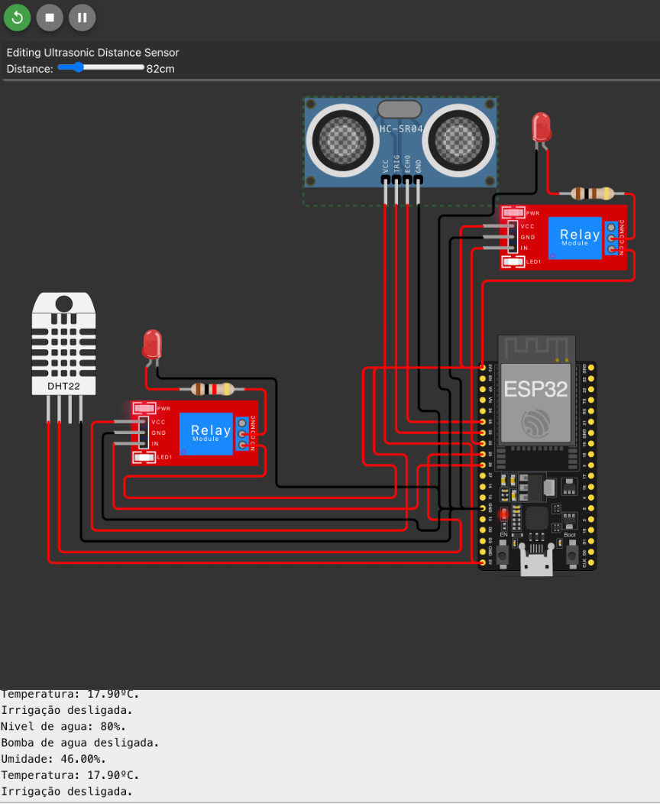
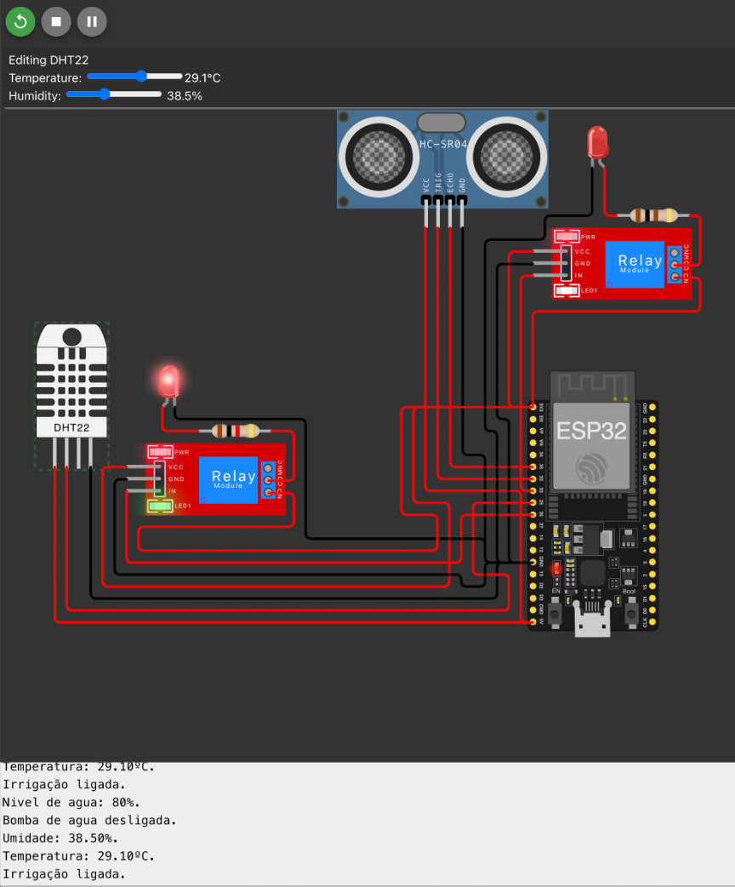
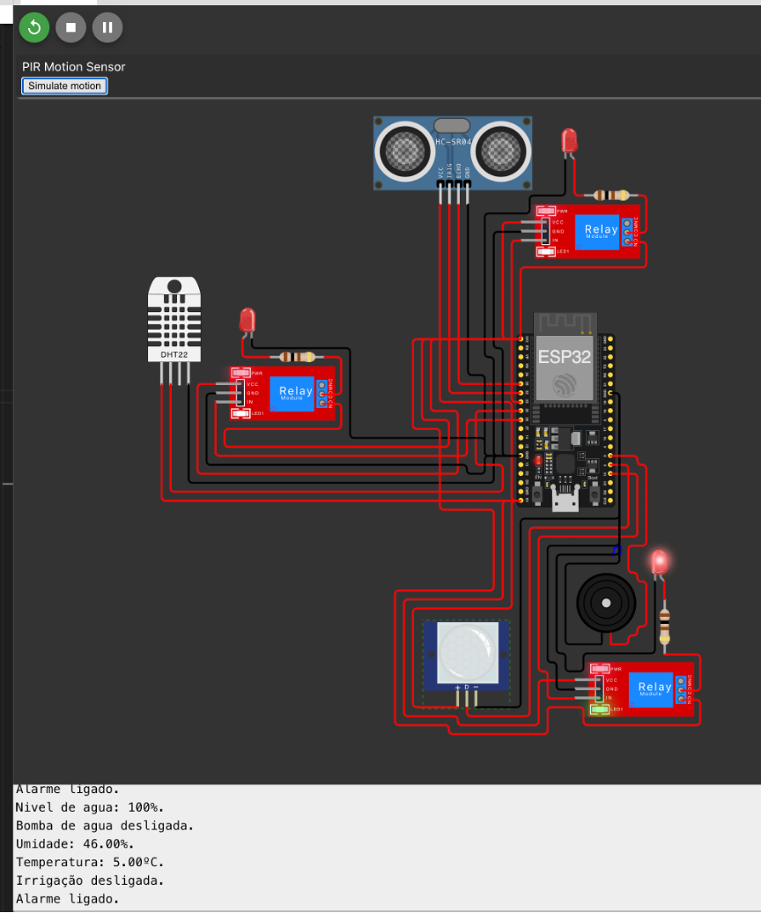

# Sistema Inteligente de Monitoramento Agrícola

## Objetivo do Projeto

Este projeto visa desenvolver um sistema inteligente de monitoramento agrícola, utilizando o microcontrolador ESP32 e quatro sensores distintos, com a plataforma de simulação Wokwi.com. O sistema é projetado para coletar dados do ambiente, automatizar a irrigação e melhorar a segurança, proporcionando um uso otimizado dos recursos agrícolas e aumentando a eficiência das operações no campo.

## Desenho do Circuito Completo com os Sensores Utilizados

O projeto consiste em um circuito integrado envolvendo o microcontrolador ESP32 e diversos componentes. O diagrama do circuito e a interligação dos sensores com o ESP32 estão descritos no arquivo [diagram.json](./src/diagram.json) .

Os componentes utilizados incluem:

- **ESP32 Devkit-C V4**: Microcontrolador principal, utilizado para gerenciar a lógica do sistema.
- **Sensor de Umidade e Temperatura (DHT22)**: Mede a temperatura e a umidade do ambiente, fornecendo dados críticos para o controle automático da irrigação.
- **Sensor de Ultrassom (HC-SR04)**: Utilizado para medir a distância de líquidos em reservatórios, monitorando o nível de água disponível para a irrigação.
- **Sensor de Movimento PIR**: Detecta a presença de animais ou pessoas em áreas monitoradas, contribuindo para a segurança da propriedade.
- **Sensor de Luz LDR (Light Dependent Resistor)**: Mede a intensidade da luz solar, permitindo que o sistema ajuste a irrigação conforme a quantidade de luz recebida pelas plantas.

## Descrição do Papel de Cada Sensor no Sistema

- **DHT22**: Responsável pela coleta de dados climáticos, como temperatura e umidade do ar, permitindo otimizar a irrigação conforme as condições do ambiente.
- **HC-SR04**: Utilizado para monitorar o nível de água nos reservatórios, garantindo que o sistema tenha água suficiente para acionar a irrigação.
- **PIR**: Detecta a presença de intrusos ou animais, acionando alarmes e contribuindo para a segurança da área.
- **LDR**: Monitora a luminosidade, ajustando a irrigação para fornecer água adicional em dias nublados ou menos água em dias ensolarados.

## Como Configurar e Rodar o Projeto no Wokwi e ESP32

O projeto pode ser simulado na plataforma [Wokwi](https://wokwi.com/projects/412384632938354689) . Para rodar o projeto:

1. Acesse o link do projeto no Wokwi.
2. Execute a simulação para visualizar a integração dos sensores e o comportamento do sistema.
3. Utilize o Monitor Serial do Wokwi para verificar as saídas e os estados dos sensores.

### Dependências Necessárias

Para rodar o código no ESP32, as seguintes bibliotecas são necessárias :
- **DHT Sensor Library**: Necessária para integrar e coletar os dados do sensor DHT22, utilizado para medir temperatura e umidade.
- **ESP32Servo**: Utilizada para controlar servos, como a válvula de irrigação, adicionando mais funcionalidades ao sistema.

As dependências podem ser instaladas pela IDE Arduino, acessando "Bibliotecas > Gerenciar Bibliotecas" e procurando pelos nomes acima.

## Testes Realizados

Os testes do sistema foram realizados manualmente, simulando diferentes cenários no Wokwi. Foram realizados casos de teste para verificar o comportamento dos sensores e dos atuadores. Abaixo estão descritos alguns dos casos de teste executados :

- **CT001**: Nível de água menor que 80% - **Resultado Esperado**: Irrigação ligada.

- **CT002**: Nível de água maior ou igual a 80% - **Resultado Esperado**: Irrigação desligada.

- **CT003**: Umidade menor que 40% ou temperatura maior que 30°C - **Resultado Esperado**: Irrigação ligada.

- **CT008**: Presença detectada pelo PIR - **Resultado Esperado**: Alarme ligado.

Capturas de tela dos testes realizados estão disponíveis no repositório.

## Links Importantes

- [Repositório do Projeto no GitHub](https://github.com/jonatasgomes/FIAP/tree/main/Fase_3/Cap12) 
- [Simulação do Projeto no Wokwi](https://wokwi.com/projects/412384632938354689) 

Para mais detalhes sobre a implementação e a documentação completa do projeto, acesse os arquivos na pasta `docs` e `src` deste repositório.
